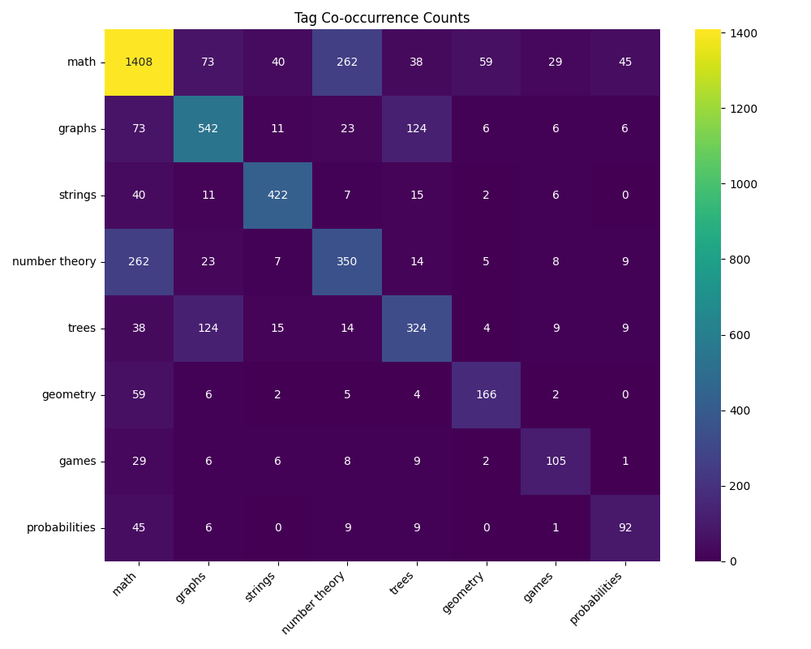
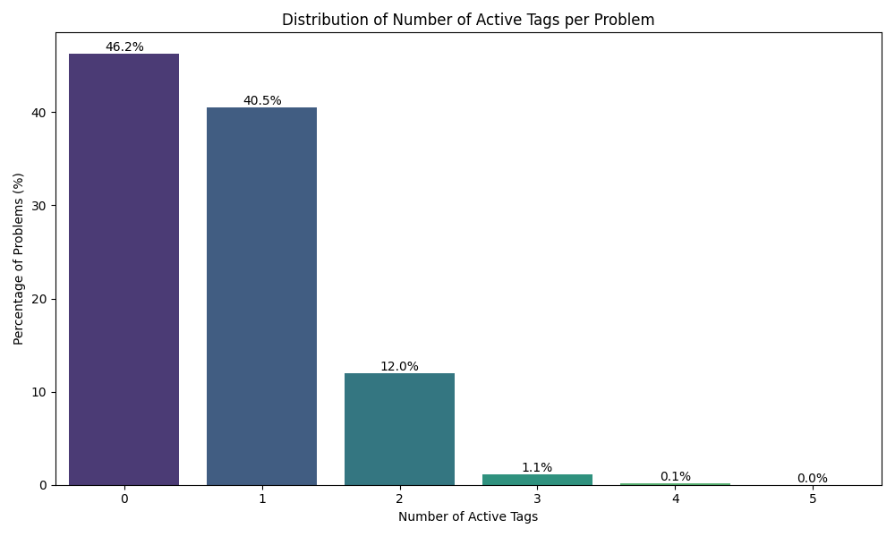
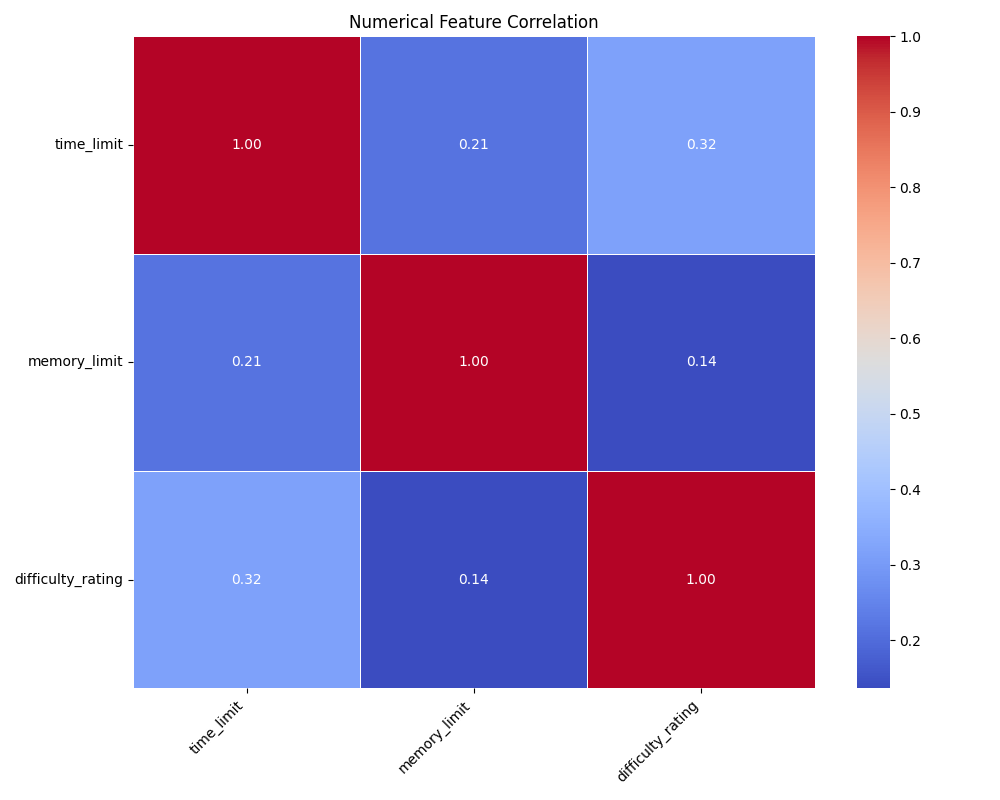
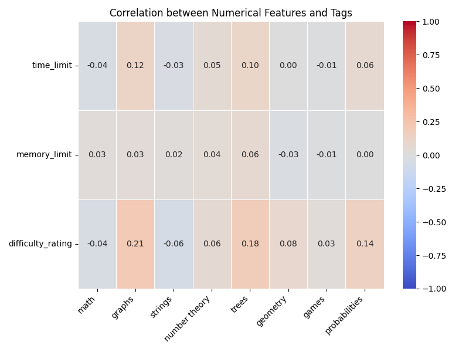

# Data Analysis Report for Cleaned Codeforces Data

Analysis performed on: `2025-04-17 09:40:08`
Data source: `codeforces_clean_data_2025-04-17.csv`

## 1. Basic Statistics

* Total problems analyzed: `4982`
* Columns included in analysis: `probabilities, time_limit, graphs, trees, output_specification, execution_result, input_specification, strings, sample_outputs, memory_limit, solution_code, problem_description, number theory, difficulty_rating, math, problem_notes, games, geometry, sample_inputs`

## 2. Tag Analysis

### Tag Co-occurrence Heatmap

This heatmap shows how often pairs of tags appear together in the dataset (raw counts).

### Distribution of Active Tags per Problem

This plot shows the percentage of problems having a specific number of assigned tags.

* Average number of tags per problem: `0.68`

## 3. Numerical Feature Correlation

### Correlation between Numerical Features

Correlation between `time_limit, memory_limit, difficulty_rating`.

### Correlation between Numerical Features and Tags

Correlation between numerical features and the presence of specific tags. Note: Correlation with binary (0/1) tags indicates association strength.

## 4. Text Feature Analysis

Statistics for selected text columns:

| Feature                 | % Missing/Empty | Avg. Length (Non-Empty) |
| ----------------------- | --------------- | ----------------------- |
| problem_notes           | 0.0%              | 319.3                      |
| problem_description     | 0.0%              | 951.21                      |
| output_specification    | 0.0%              | 204.11                      |
| input_specification     | 0.0%              | 403.23                      |
| sample_inputs           | 0.0%              | 68.82                      |
| sample_outputs          | 0.0%              | 29.73                      |
| solution_code           | 0.0%              | 1232.57                      |
| execution_result        | 0.0%              | 6.0                      |
